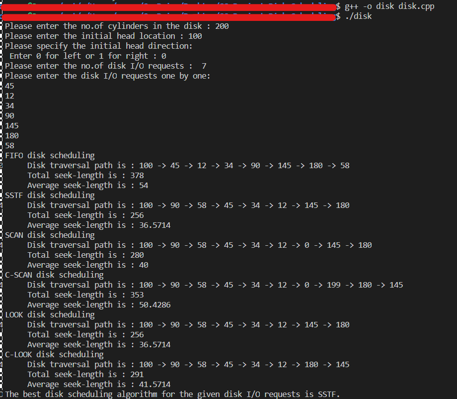
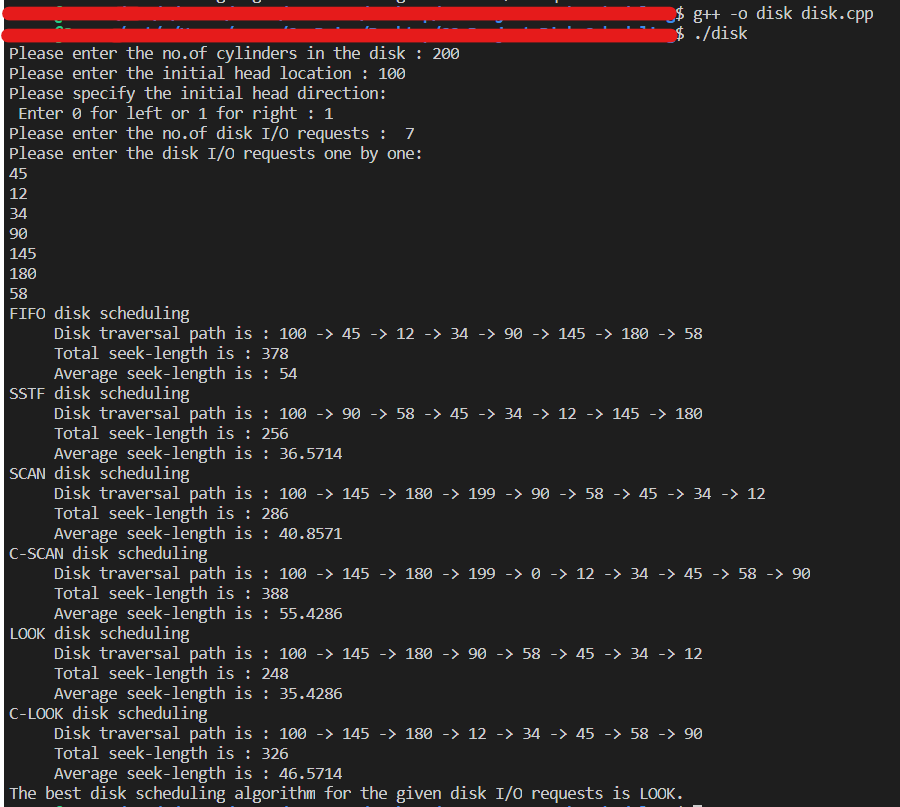

# Disk-Scheduling-Algorithms-Analysis
A simple program that helps in analysing which disk scheduling algorithm is efficient for a particular set of disk I/O requests. The program's output also contains the total seek-length, average seek-length and path of disk head for each disk scheduling algorithm. 

# Disk Scheduling Algorithms
- FIFO
- SSTF
- SCAN
- C-SCAN
- LOOK
- C-LOOK

# Output
-If the initial disk head direction is left :- 

-If initial disk head direction is right :-

# Author
- Saran
